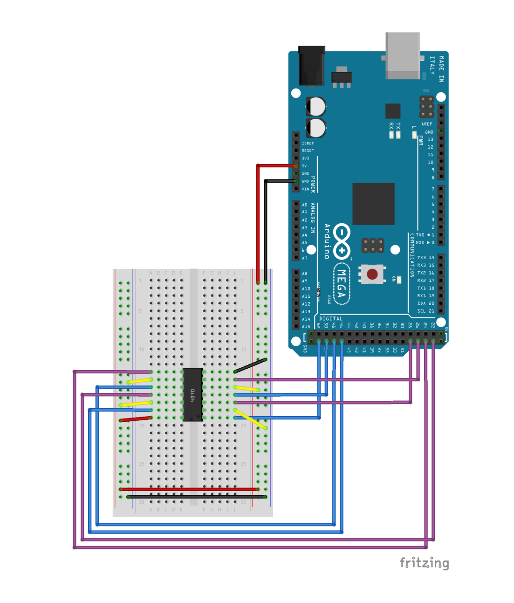
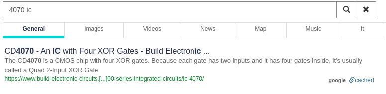
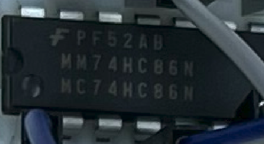

# Dweeno

## Category: Hardware

### We found this wack program running on an Arduino Mega using some spider-looking thing on a breadboard. The information we need is redacted in the program we found, but we managed to grab the serial output from the program. Help us figure out what this information is!

## A look at the resources

What do we have?

* source.ino - Arduino IDE sketch. Basically source code for some binary
* sketch.pdf - a connection diagram for whatever is running the said binary
* setup.jpg - a convenient photo of an actual real-world setup
* output.txt - some binary data; 38 lines-long, each line is 8 bits (probably a 38-character string)

## Analyzing the setup

The connection diagram caught my eye immediately. We can see an Arduino MEGA here, connected to an unidentified IC on the breadboard.



**4070** is written on the IC, so I do a quick lookup.




This gives me an idea of what I may be looking at. Specifically, _4 XOR gates in one assembly_.

**setup.jpg** includes the actual IC marking.



Look _MC74HC86N_ up... And bingo! We have the pinout.


Let's take a look at the source now.

**void loop()** is very simple to understand. Enjoy my explanation in the comments.

```c
void loop() {    
  if (i < strlen(flag)) {    //char * flag
    curr = binary(flag[i]);    //binary (int number) is converting the flag byte-by-byte into 8-bit binary strings
    first = curr.substring(0,4);     //first half of binary string
    second = curr.substring(4,8);    //second half of binary string
    Serial.print(get_output(first));    //operate on the first half
    Serial.println(get_output(second));    //operate on the second half
    delay(1000);
    i++;
  }
}
```

The only other function I'll explain is **String get_output(String bits)**.

```c
String get_output(String bits) {    
    String output;                                              // process 4 bits at a time
    digitalWrite(out1, ((bits[0] == '1')? HIGH : LOW));         //write each bit in parallel to the 'out' pins
    digitalWrite(out2, ((bits[1] == '1')? HIGH : LOW));    
    digitalWrite(out3, ((bits[2] == '1')? HIGH : LOW));    
    digitalWrite(out4, ((bits[3] == '1')? HIGH : LOW));    
    delay(1000);    
    output += String(digitalRead(in1));                         //collect each xor'd bit in parallel from the 'in' pins
    output += String(digitalRead(in2));    
    output += String(digitalRead(in3));    
    output += String(digitalRead(in4));    
    return output;                                              //that's it!
}  
```

And here we have the mapping of our input and output pins.

```c
int in1=29, in2=27, in3=25, in4=23;
int out1=53, out2=51, out3=49, out4=47;
```

With this, I'll simplify the connection diagram a bit.


Here, I marked each XOR operation in order. Basically, the gates take one input from the corresponding pin on the Arduino, and the other from either +5V bus or GND bus. +5V is a logical 1 in this case, while GND is a logical 0.

## Writing a script to decode the output

With this information, writing a decoder is as simple, as xoring each line in **output.txt** one more time.

```python
#!/usr/bin/python3

import sys

outstr = ""                                                         # create output string

def xor(bits):

    ret = ""

    ret += str(int(bits[0]) ^ 0)                                    #xor 4 bits at a time
    ret += str(int(bits[1]) ^ 1)
    ret += str(int(bits[2]) ^ 0)
    ret += str(int(bits[3]) ^ 1)

    return ret

with open(sys.argv[1], "r") as inFile:                              #take filename as argv[1]

    for line in inFile.readlines():

        line = line.strip()

        part1 = line[0:4]                                           #divide each line into 4-bit parts
        part2 = line[4:8]

        outstr += chr(int(xor(part1) + xor(part2),2))               #xor the two parts, concatenate them, convert everything to a character, append to output string

print(outstr)
```

```
 ./rev.py output.txt 
flag{a16b8027cf374b115f7c3e2f622d84bc}
```

Easy. But very neat :) 

Fantastic hardware challenge for beginners IMO.
