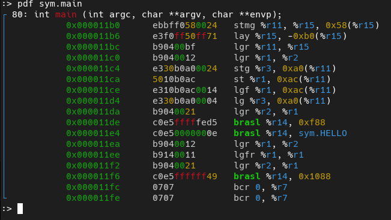
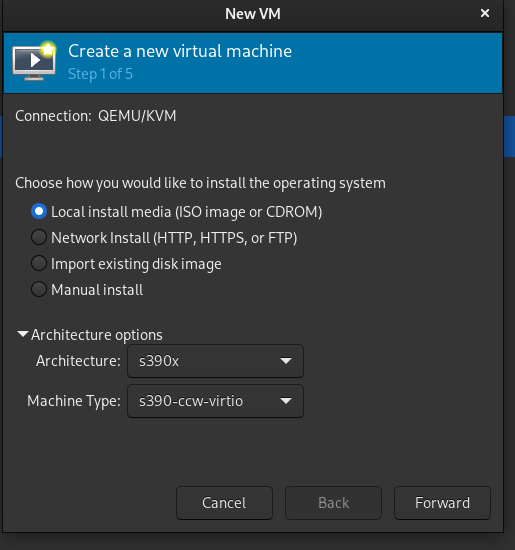
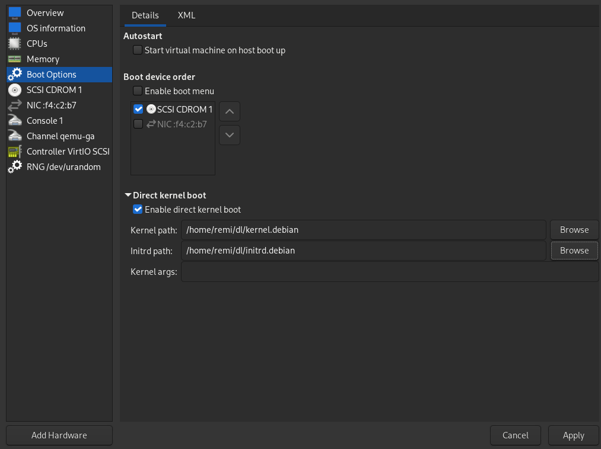
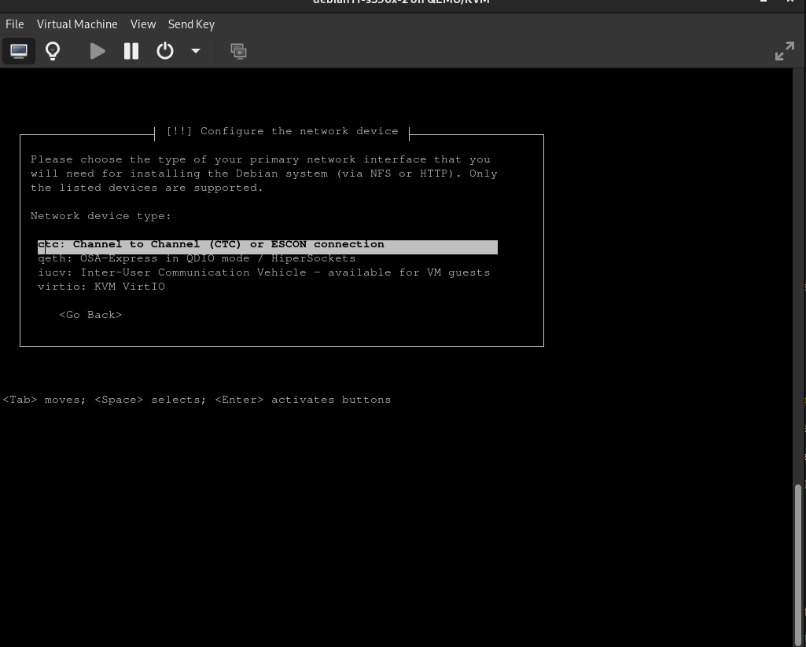
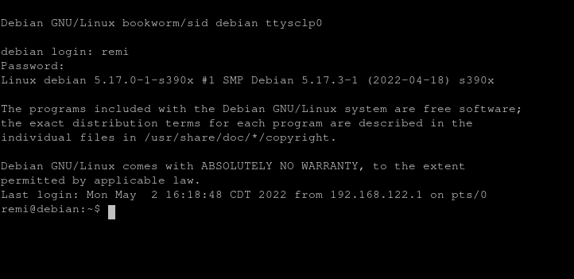
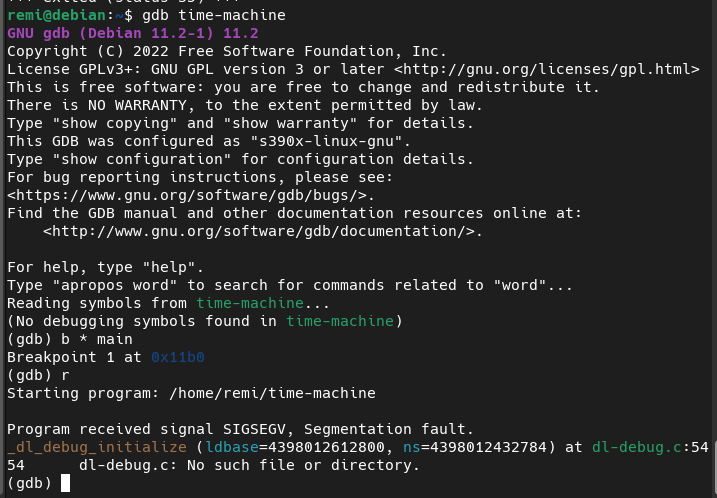
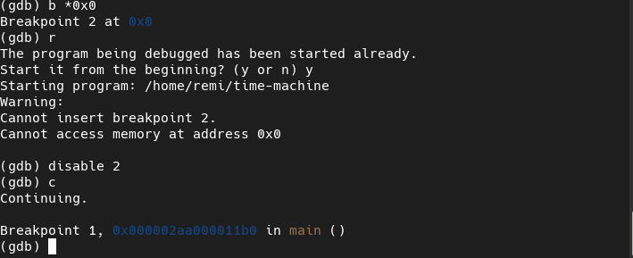
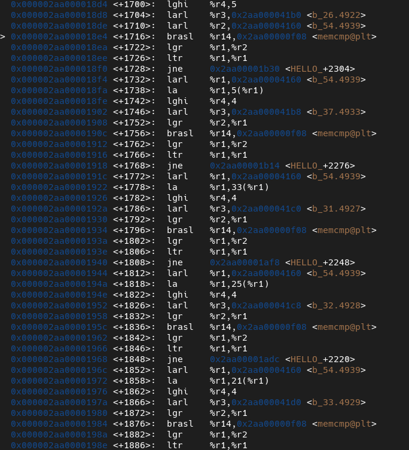

# Time Machine

## Category: rev

### I found this program on my grandpa's mainframe... can you help me get in?

## Look at the resources

All we get is a binary called `time-machine`.

```
 ./time-machine 
bash: ./time-machine: cannot execute binary file: Exec format error
```

**Exec format error**? Let's dig deeper.

```
 file time-machine 
time-machine: ELF 64-bit MSB pie executable, IBM S/390, version 1 (SYSV), dynamically linked, interpreter /lib/ld64.so.1, BuildID[sha1]=b67d80f8987b35168815bd37d451527f4ca05f5c, for GNU/Linux 3.2.0, not stripped

```

Running `file` reveals that this binary is made for IBM S/390.

What's IBM S/390? Well...


_Alriiighty, that's an interesting start._

## Static analysis (miserable) attempts

**strings**

```
 strings -n 10 time-machine
/lib/ld64.so.1
libcob.so.4
...
truncated
...
Something seems wrong... quitting.
System checks complete.
Found file performing security check...
Missing security key... quitting.
Found password: 
Password correct! Continuing...
Incorrect password! Quitting.
Hey kiddo... looks like you found it after all!
Such a disappointment...
You got it! Well done <3
.security.check
```

**radare2**



_woah!_

`stmg`? `lay`? `brasl`?

radare2 does a fantastic job at disassembling some weird obscure architecture code but I'm not sure that I can say the same about myself.
None of these instructions are familiar to me.

So, considering the lack of documentation for this assembly syntax _(seriously, I couldn't find descriptions of most mnemonics after an hour of searching)_ and the fact that one of the important functions is **3488** instructions long, I'll try my luck with...

## Dynamic analysis (part 1: suffering through environment preparation)

Now I don't know about you, but I don't own a 20 year old mainframe to run this thing on.

This leaves me with the only option of **emulating the damn cabinet**. 

Searching for info on the topic of emulating an s390x CPU made several things clear:

    1. Debian has support for s390x architecture and provides a netboot ISO
    2. Full-software emulator called "Hercules" exists
    3. QEMU system mode emulation seems to be an option too

So I tried Hercules. _It was slow._

I also tried the qemu option a little, but it just wouldn't boot. I knew that some special procedure is used for this architecture, but there was too little information for me to figure it out yet.

About an hour of searching later, I found this [helpful little thing](https://gist.github.com/paboldin/9e5c0f64b2f98d99dfa228d7dc812c4f).

From the helpful little thing, I found out about the **Direct kernel boot** option in virt-manager.

So I try to set the machine up with the provided kernel and initrd...





...and **oh my**, this emulated abomination prompts me to install Debian on it! @_@



One veeeery slow Debian installation process later...



Neat. I installed **ltrace**, **strace**, and **gdb** for debugging the binary.
That ends the environment preparation.

## Dynamic analysis (part 2: debugging the debugger)

Let's run it.

```
./time-machine 
System checks complete.
Missing security key... quitting.
```

Ah, well... Let's run it again :P

```
ltrace ./time-machine 
__libc_start_main(0x2aa388011b0, 1, 0x3ffe3cfef68, 0x2aa38802188 <unfinished ...>
cob_init(1, 0x3ffe3cfef68, 0x3ffe3cfef78, 0x102e985d7d145f) = 0x4011
cob_module_global_enter(0x2aa388040d0, 0x3ffe3cfdbd8, 0, 0) = 0
cob_check_version(0x2aa388023c6, 0x2aa388023c0, 0, 0x3ed1) = 0x3010200
cob_set_cancel(0x2aa38ea4ea0, 3, 0x3ff00000001, 0) = 0
memset(0x2aa38804128, ' ', 9)                  = 0x2aa38804128
memset(0x2aa388040f0, '\0', 16)                = 0x2aa388040f0
memset(0x2aa38804160, ' ', 38)                 = 0x2aa38804160
cob_file_malloc(0x2aa38804118, 0, 0, 0)        = 0x2aa38ea5040
memset(0x2aa38804212, '0', 2)                  = 0x2aa38804212
cob_file_malloc(0x2aa38804150, 0, 0, 0)        = 0x2aa38ea50f0
memset(0x2aa38804216, '0', 2)                  = 0x2aa38804216
cob_sys_check_file_exist(0x2aa388040e0, 0x2aa388040f0, 0, 0) = 35
cob_display(0, 1, 1, 0x2aa38803c18System checks complete.
)            = 0
cob_sys_check_file_exist(0x2aa38804108, 0x2aa388040f0, 0x2aa38e95f00, 1) = 35
cob_display(0, 1, 1, 0x2aa38803c48Missing security key... quitting.
)            = 0
cob_stop_run(35, 1, 0x2aa38e95f00, 0x2aa00000021 <unfinished ...>
__cxa_finalize(0x2aa38804008, 0x2aa38803bf8, 0x3ff00000001, 1) = 0x3ff00000000
+++ exited (status 35) +++
```

Functions starting with **cob** are probably COBOL functions. 

_Makes sense for someone's gramps to code in COBOL_

```
cob_sys_check_file_exist(0x2aa38804108, 0x2aa388040f0, 0x2aa38e95f00, 1) = 35
```
This line looks like a file check. Let's try to go deeper with strace.

```
write(1, "System checks complete.\n", 24System checks complete.
) = 24
stat(".security.check", 0x3ffd2b7d710)  = -1 ENOENT (No such file or directory)
write(1, "Missing security key... quitting"..., 34Missing security key... quitting.
) = 34
exit_group(35)                          = ?
+++ exited with 35 +++
```

_.security.check_ is the file we're looking for.

```
touch .security.check ; ./time-machine
System checks complete.
Found file performing security check...
Found password:          
Incorrect password! Quitting.
```

Let's ltrace one more time.

```
cob_sys_check_file_exist(0x2aa07884108, 0x2aa078840f0, 0x2aa08737f00, 1) = 0
cob_display(0, 1, 1, 0x2aa07883c30Found file performing security check...
)            = 0
cob_open(0x2aa08747040, 1, 0, 0)               = 0x3ff00000000
cob_read_next(0x2aa08747040, 0, 1, 0)          = 49
cob_close(0x2aa08747040, 0, 0, 0)              = 0x3ff00000000
cob_display(0, 1, 2, 0x2aa07883c60Found password:          
)            = 0
memcmp(0x2aa07884128, 0x2aa078823b6, 9, 0x2aa00000001) = -2
cob_display(0, 1, 1, 0x2aa07883c90Incorrect password! Quitting.
```

Aha. A _memcmp_. To see the memory contents, let's try gdb.



As apparently nothing can be easy when it comes to s390x, gdb segfaults while trying to load some source for debugging.

This is a bug. Moreover, this is a bug in the debugger.

Welp, there is a way around.



Setting an illegal breakpoint, running the binary, and disabling the said breakpoint allows gdb to proceed.

## Dynamic analysis (part 3: Finally, reversing the binary)

Our function of interest is called `HELLO_`. And this fragment contains our memcmp call from earlier. 

```
   0x000002aa00001646 <+1046>:	lghi	%r4,9
   0x000002aa0000164a <+1050>:	larl	%r3,0x2aa000023b6
   0x000002aa00001650 <+1056>:	larl	%r2,0x2aa00004128 <b_39.4935>
   0x000002aa00001656 <+1062>:	brasl	%r14,0x2aa00000f08 <memcmp@plt>

```

Examining the value, that goes in r3 we get:

```
x/s 0x2aa000023b6
0x2aa000023b6:	"blueberry"
```

```
echo "blueberry" > .security.check ; ./time-machine
System checks complete.
Found file performing security check...
blueberry
Found password: blueberry
Password correct! Continuing...
Such a disappointment...
```

We're getting somewhere. One more strace.

```
write(1, "Password correct! Continuing...\n", 32Password correct! Continuing...
) = 32
stat(".gramps", 0x3ffda17d5d0)          = -1 ENOENT (No such file or directory)
write(1, "Such a disappointment...\n", 25Such a disappointment...
) = 25
exit_group(35)                          = ?
+++ exited with 35 +++
```

It's looking for another file called ".gramps".

```
 touch .gramps ; ./time-machine 
System checks complete.
Found file performing security check...
blueberry
Found password: blueberry
Password correct! Continuing...
Hey kiddo... looks like you found it after all!
no
```

_Yeah, right_.

```
cob_display(0, 1, 1, 0x2aa1af83ca8Hey kiddo... looks like you found it after all!
)            = 0
cob_open(0x2aa1c76e0f0, 1, 0, 0)               = 0x3ff00000000
cob_read_next(0x2aa1c76e0f0, 0, 1, 0)          = 49
cob_close(0x2aa1c76e0f0, 0, 0, 0)              = 0x3ff00000000
memcmp(0x2aa1af84160, 0x2aa1af841b0, 5, 0x2aa1c75db80) = -2
cob_display(0, 1, 1, 0x2aa1af83cf0no
)            = 0
cob_stop_run(0, 1, 0x2aa1c75ef00, 0x2aa00000021 <unfinished ...>
__cxa_finalize(0x2aa1af84008, 0x2aa1af83bf8, 0x3ff00000001, 1) = 0x3ff00000000
+++ exited (status 0) +++
```

Another ltrace reveals one more memcmp call. 

```
   0x000002aa000018d8 <+1704>:	larl	%r3,0x2aa000041b0 <b_26.4922>
   0x000002aa000018de <+1710>:	larl	%r2,0x2aa00004160 <b_54.4939>
   0x000002aa000018e4 <+1716>:	brasl	%r14,0x2aa00000f08 <memcmp@plt>
```

Examine value in r3...

```
x/s 0x2aa000041b0
0x2aa000041b0 <b_26.4922>:	"flag{"
```

Aha! This needs to go in the ".gramps" file, as the file is being read earlier in the code.

The rest of the process is just the same kind of memcmp calls that reveal our flag in little fragments.



The order of some fragments is mixed up a bit...

```
   0x000002aa00001972 <+1858>:	la	%r1,21(%r1)
   0x000002aa00001976 <+1862>:	lghi	%r4,4
   0x000002aa0000197a <+1866>:	larl	%r3,0x2aa000041d0 <b_33.4929>
   0x000002aa00001980 <+1872>:	lgr	%r2,%r1
   0x000002aa00001984 <+1876>:	brasl	%r14,0x2aa00000f08 <memcmp@plt>
```

...but the `la` (load address) instruction points to the right position by using displacement (21 in this case).

A displacement is simply added to the second operand, which means that it's just a string offset.

Going through all the calls leaves us with this lovely sight:

```
flag{1d2ae37ac40cbc0b721e8789a76e208e}
```

```
 echo "flag{1d2ae37ac40cbc0b721e8789a76e208e}" > .gramps ; ./time-machine
System checks complete.
Found file performing security check...
blueberry
Found password: blueberry
Password correct! Continuing...
Hey kiddo... looks like you found it after all!
You got it! Well done <3
```

**Nice!**

I didn't solve this challenge during the live event. I only even noticed it after the CTF was done, but it was still a lot of fun.

Also, emulating s390x might not be the intended way, but it was the most interesting one for me :)
