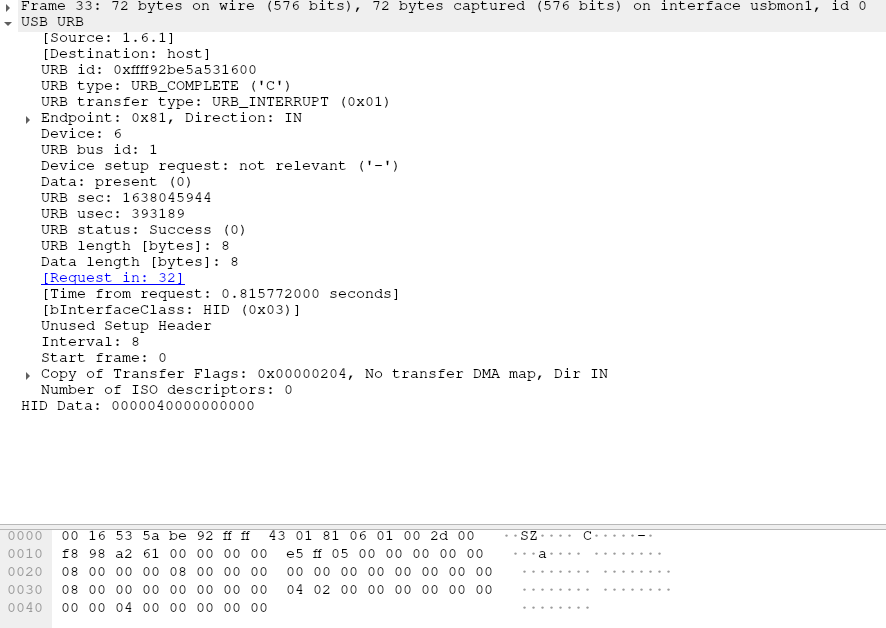

# UH, SUSSY BAKKA
## Category: FORENSICS
### Walter is back at it again! He hid underneath my desk before I came in to work and something feels off! He sent me this file. Can you tell me what's up with it?

## Initial analysis

Looking at the _chall.pcapng_ in wireshark, we can see a bunch of USB packets. This is not the first time I'm dealing with usb captures, but this time is a bit different. **URB_INTERRUPT in** is a type of packets I never heard of, so naturally, I google it.


It was easy to discover, that these packets are just interrupts, passed on the USB bus. The first thing, that comes to my head, that could generate such interrupts are USB HID devices. We have a **device to host** communication here, as can be seen in the _Source_ and _Destination_ fields.
There are 2 types of interrupt packets here: _completed_ and _submitted_. As I found out, with device to host communication, the actual data is usually in the _completed_ packets. I apply a filter to look for these packets: `usb.darwin.request_type == 1`.
Scrolling through the file, I notice that the only changing field, besides the I/O ID (which is unique for every transaction) is the **Leftover Capture Data**, which will have to be extracted.

But first, I want to know, which HID device is sending the packets. I tried to capture my mouse traffic with wireshark and _usbmon_ kernel module (`sudo modprobe usbmon`), but it looked completely different.


But my keyboard looks identical. This is me pressing the "a" key.



## Extraction and parsing

With this established, we can extract the interesting data. I did it with the following command: `tshark -r chall.pcapng -T fields -e usb.capdata > sussy.dat`. Which resulted in a file of such format:
```
0400000000000000

04002b0000000000

00002b0000000000

0000000000000000

0200000000000000
```

Next, the parsing. But first, we have to know the format of the messages to convert them into a string of typed characters.
Luckily for me, I found it in under a minute on `https://wiki.osdev.org/USB_Human_Interface_Devices#USB_keyboard`.
Quickly reading up on the message format, we establish, that:
* The first byte is the modifier key code
* The second byte is reserved
* Bytes 3-8 are regular key scancodes

With that, I take a look at our dumped messages.
```
04002b0000000000   # This is an Alt-Tab
0200170000000000   # This is a capital T
```
Makes sense so far. Now, we just need a way to parse the messages. We could do it by hand, or write a script, _which is totally, definitely, and absolutely the way I did it during the live event (i swear)_.

## Writing a simple parser

Our parser needs to split the dump file by lines, pull scancodes out of each line, and put together a string, that was typed. To do this, we need some line splitting:
```python
infilebuf = list()
with open(sys.argv[1], 'r') as infile:
    line = infile.readline()
    while line:
        if line != "\n":
            infilebuf.append(line.strip())
        line = infile.readline()
```
, a function to parse the scancodes:
```python
def interpret(data):

    modbit = int(data[0:2], 16)
    keybit = int(data[4:6], 16)


    if keybit == 0:
        return None

    SHIFT = False

    if modbit == scancodes.mods["LSHIFT"] or modbit == scancodes.mods["RSHIFT"]:         #test if shift is on
        SHIFT = True

    try:
        if not SHIFT:
            return scancodes.keys[keybit][0]
        else:
            return scancodes.keys[keybit][1]
    except KeyError:            #handle unmatched codes
        return None
```
, and basic keyboard scancodes:
```python
class scancodes:

    mods = {
        "LCTRL"  :0x01,
        "LSHIFT" :0x02,
        "LALT"   :0x04,
        "LMETA"  :0x08,
        "RCTRL"  :0x10,
        "RSHIFT" :0x20,
        "RALT"   :0x40,
        "RMETA"  :0x80,
    }

    keys = {                # scancode : (without_shift, with_shift)

        0x04 : ("a", "A"),
        0x05 : ("b", "B"),
        0x06 : ("c", "C"),
        0x07 : ("d", "D"),
        0x08 : ("e", "E"),
        0x09 : ("f", "F"),
        0x0a : ("g", "G"),
        0x0b : ("h", "H"),
        0x0c : ("i", "I"),
        0x0d : ("j", "J"),
        0x0e : ("k", "K"),
        0x0f : ("l", "L"),
        0x10 : ("m", "M"),
        0x11 : ("n", "N"),
        0x12 : ("o", "O"),
        0x13 : ("p", "P"),
        0x14 : ("q", "Q"),
        0x15 : ("r", "R"),
        0x16 : ("s", "S"),
        0x17 : ("t", "T"),
        0x18 : ("u", "U"),
        0x19 : ("v", "V"),
        0x1a : ("w", "W"),
        0x1b : ("x", "X"),
        0x1c : ("y", "Y"),
        0x1d : ("z", "Z"),
        0x1e : ("1", "!"),
        0x1f : ("2", "@"),
        0x20 : ("3", "#"),
        0x21 : ("4", "$"),
        0x22 : ("5", "%"),
        0x23 : ("6", "^"),
        0x24 : ("7", "&"),
        0x25 : ("8", "*"),
        0x26 : ("9", "("),
        0x27 : ("0", ")"),
        0x2d : ("-", "_"),
        0x2e : ("=", "+"),
        0x2f : ("[", "{"),
        0x30 : ("]", "}"),
        0x31 : ("\\", "|"),
        0x33 : (";", ":"),
        0x34 : ("'", "\""),
        0x35 : ("`", "~"),
        0x36 : (",", "<"),
        0x37 : (".", ">"),
        0x38 : ("/", "?"),
    }
```
My code only handles the bare minimum codes and modifiers, but this is enough for the challenge.

Then we run it and get the flag:
```
[remi@station sussy]$ ./kparser.py sussy.dat 
TFCCTF{w4lt3r_y0u_su55y_b4k4!Why_ar3_y0u_h1d1ng_und3rn34th_my_d3sk}
```

Simple enough! This was a such a nice challenge, that I decided to do my first writeup ever for it. Thanks to **hofill** for creating it, and to you for reading this <3. ~~double thanks to hofill if they are reading this, of course~~
