# Lost Dungeon 1,2
## Category: rev
### Welcome Adventurer! Legend has it that there lies a dungeon filled with powerful beasts which can be tamed to reveal a secret message. The path to the dungeon is long and arduous. No one who has found the dungeon has returned back as once the beasts get to you they never leave. Can you reach the dungeon and tame the beasts?

_the decompilation of all game logic can be found under ./res/decompilation_

## Initial analysis and environment setup

Well, we have a **game hacking** challenge here, as is obvious from the challenge contents. Moreover, the game itself looks to be a _Unity_ game for windows. Ideal environment for me would be a local virtual machine with a GPU attached. Luckily, I already have one of those :P.

But first, I decided to poke around the game files. I'm not familiar with Unity engine whatsoever, so I just checked everything and found some ascii strings.

```
Game_Data/level0:
I heard that the beasts in the dungeon will chase you forever if they get to you!
Apparently if you lift the curse from the beasts they arrange themselves in a peculiar way to thank you!
Only wizards can use the portal
Game_Data/level1:
Maybe if you could respawn here you could find what you are looking for?
Ah you found the hidden level. But unfortunately you spawned in the wrong place. 
If only you could respawn in this map
Game_Data/level2:
This is not the place you are looking for lol
Game_Data/level3:
This is not the place you are looking for
```

_Interesting..._ With that, I went ahead and ran the game under windows environment.

## A look at the game itself

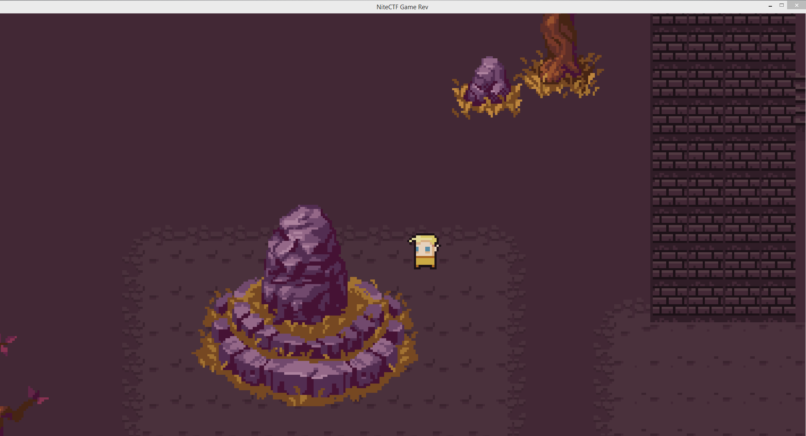

Looks nice! You can run around and interact with npcs. Each npc tells you something about the mechanics.
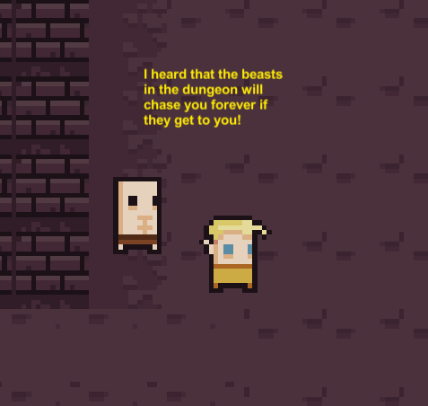
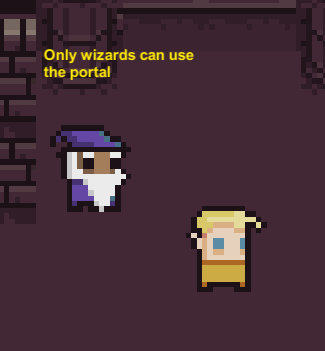
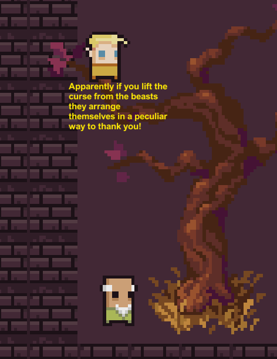

The portal doesn't let me in (I guess I'm not a wizard after all). Aside from that, there's a **really** long hallway to the east of the spawnpoint. The character moves way too slowly for such marathons, so I figured, that a speedhack would be handy. CheatEngine to the rescue!.
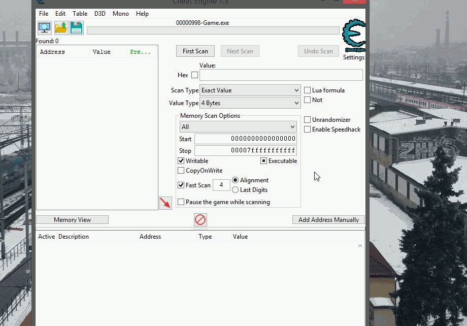

_well, that didn't work_.
~~(then again, I'm not exactly a competent cheater, maybe I just did something wrong)~~

## Researching Unity engine

It was obvious, that I needed to do some research on unity games to be able to advance.
That brought me to this wonderful forum post: https://www.unknowncheats.me/forum/unity/285864-beginners-guide-hacking-unity-games.html

I downloaded **dnSpy**, loaded _Assembly-CSharp.dll_ and got presented with some surprisingly readable and structured decompilation.
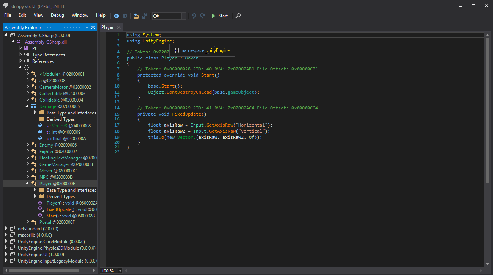

Even more surprising was the ease of editing and recompiling it. You can edit the C# representation of the code with a simple _right click->edit_, and compile the whole thing with _file->Save Module_.

## Speedhack

So, let's make a speedhack! 
```C#
using System;
using UnityEngine;

// Token: 0x0200000E RID: 14
public class Player : Mover
{
	// Token: 0x06000028 RID: 40 RVA: 0x00002AB1 File Offset: 0x00000CB1
	protected override void Start()
	{
		base.Start();
		Object.DontDestroyOnLoad(base.gameObject);
	}

	// Token: 0x06000029 RID: 41 RVA: 0x00002AC4 File Offset: 0x00000CC4
	private void FixedUpdate()
	{
		float axisRaw = Input.GetAxisRaw("Horizontal");
		float axisRaw2 = Input.GetAxisRaw("Vertical");
		this.o(new Vector3(axisRaw, axisRaw2, 0f)); //here is the important bit
	}
}
```
In the decompiled version of **player** class, movement is implemented with `Input.GetAxisRaw` and passed as a 3d vector to the `Mover.o` function.
```C#
		this.o(new Vector3(axisRaw * 0x30, axisRaw2 * 0x30, 0f)); //here is the important bit
```
Multiplying the values was the most straightforward way to implement a speedhack, so that's exactly how I did it.

Compile, save, load the game...
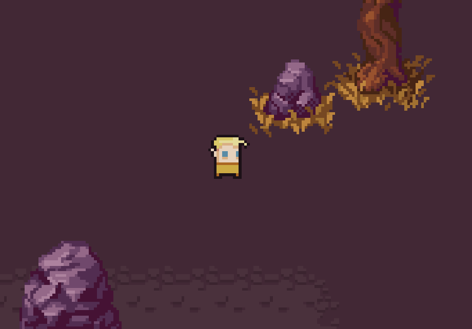

And here we go!

_some extraordinairly long hallway travelling later..._

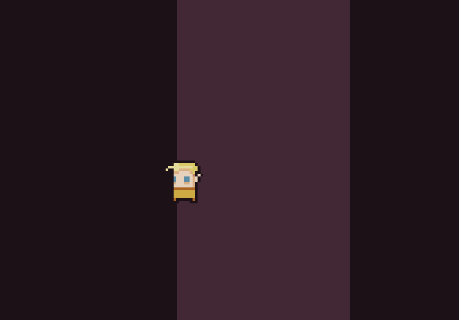

Ah, these are the promised monsters.

Judging by the third npc's line,
and this:

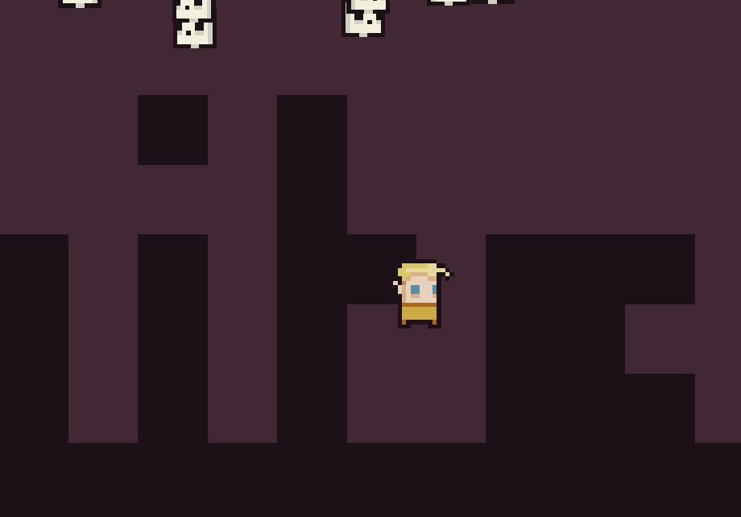

and even this:

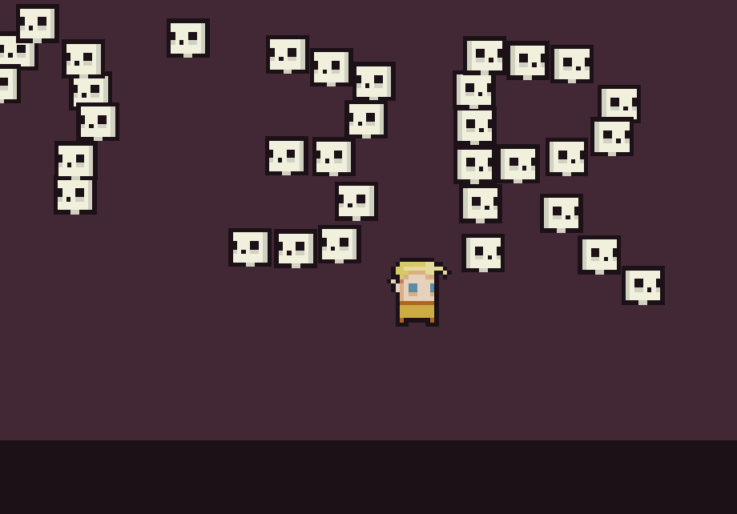

... we gotta stop the monsters from following the player, so that they arrange themselves and give us the first flag.

## Defeating the beasts

Monster logic in this game is not too complicated.

```C#
using System;
using UnityEngine;

// Token: 0x02000006 RID: 6
public class Enemy : Mover
{
	// Token: 0x0600000B RID: 11 RVA: 0x00002264 File Offset: 0x00000464
	protected override void Start()
	{
		base.Start();
		this.x = GameManager.instance.player.transform;
		this.y = base.transform.position;
		this.z = this.x.GetChild(0).GetComponent<BoxCollider2D>();
	}

	// Token: 0x0600000C RID: 12 RVA: 0x000022B4 File Offset: 0x000004B4
	private void FixedUpdate()
	{
		if (Vector3.Distance(this.x.position, this.y) < this.chaseLenght)
		{
			this.v = (Vector3.Distance(this.x.position, this.y) < this.triggerLenght);
			if (this.v)
			{
				if (!this.w)
				{
					this.o((this.x.position - base.transform.position).normalized);
				}
			}
			else
			{
				this.o(this.y - base.transform.position);
			}
		}
		else
		{
			this.o(this.y - base.transform.position);
			this.v = false;
		}
		this.w = false;
		this.bn.OverlapCollider(this.filter, this.ba);
		for (int i = 0; i < this.ba.Length; i++)
		{
			if (!(this.ba[i] == null))
			{
				if (this.ba[i].tag == "Fighter" && this.ba[i].name == "Player")
				{
					this.w = true;
				}
				this.ba[i] = null;
			}
		}
	}

	// Token: 0x0400000B RID: 11
	public int xpValue = 1;

	// Token: 0x0400000C RID: 12
	public float triggerLenght = 1f;

	// Token: 0x0400000D RID: 13
	public float chaseLenght = 5f;

	// Token: 0x0400000E RID: 14
	private bool v;

	// Token: 0x0400000F RID: 15
	private bool w;

	// Token: 0x04000010 RID: 16
	private Transform x;

	// Token: 0x04000011 RID: 17
	private Vector3 y;

	// Token: 0x04000012 RID: 18
	public ContactFilter2D filter;

	// Token: 0x04000013 RID: 19
	private BoxCollider2D z;

	// Token: 0x04000014 RID: 20
	private Collider2D[] ba = new Collider2D[10];
}
```

`this.o` object is from the _Mover_ class.

```C#
protected virtual void o(Vector3 a)
	{
		this.bo = new Vector3(a.x * this.br, a.y * this.bq, 0f);
		if (this.bo.x > 0f)
		{
			base.transform.localScale = Vector3.one;
		}
		else if (this.bo.x < 0f)
		{
			base.transform.localScale = new Vector3(-1f, 1f, 1f);
		}
		this.bp = Physics2D.BoxCast(base.transform.position, this.bn.size, 0f, new Vector2(0f, this.bo.y), Mathf.Abs(this.bo.y * Time.deltaTime), LayerMask.GetMask(new string[]
		{
			"Actor",
			"Blocking"
		}));
		if (this.bp.collider == null)
		{
			base.transform.Translate(0f, this.bo.y * Time.deltaTime, 0f);
		}
		this.bp = Physics2D.BoxCast(base.transform.position, this.bn.size, 0f, new Vector2(this.bo.x, 0f), Mathf.Abs(this.bo.x * Time.deltaTime), LayerMask.GetMask(new string[]
		{
			"Actor",
			"Blocking"
		}));
		if (this.bp.collider == null)
		{
			base.transform.Translate(this.bo.x * Time.deltaTime, 0f, 0f);
		}
	}
```

It just transforms the entity position, according to the vector, passed to it, as an argument.
So, to stop the monsters from moving, it is sufficient to just remove the calls to this object.

```C#
	private void FixedUpdate()
	{
		if (Vector3.Distance(this.x.position, this.y) < this.chaseLenght)
		{
			this.v = (Vector3.Distance(this.x.position, this.y) < this.triggerLenght);
			if (this.v)
			{
				if (!this.w)
				{
				// remove this	this.o((this.x.position - base.transform.position).normalized);
				}
			}
			else
			{
				// and this this.o(this.y - base.transform.position);
			}
		}
		else
		{
			// and finally, this this.o(this.y - base.transform.position);
			this.v = false;
		}
		this.w = false;
		this.bn.OverlapCollider(this.filter, this.ba);
		for (int i = 0; i < this.ba.Length; i++)
		{
			if (!(this.ba[i] == null))
			{
				if (this.ba[i].tag == "Fighter" && this.ba[i].name == "Player")
				{
					this.w = true;
				}
				this.ba[i] = null;
			}
		}
	}
```

That's it! The monsters should no longer be able to move.
Let's try it out.

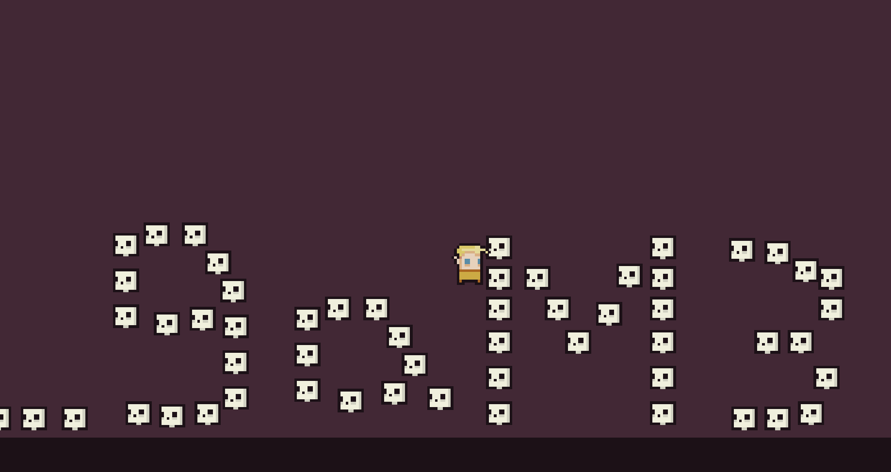

nite{Eb1c_9aM3R} sure looks like a flag to me! 

## The second part of the challenge

### Welcome Adventurer! There is a portal that teleports you to other levels but unfortunately only wizards can use it. Can you figure out how to make the portal work and get to the hidden level "level0"?

Let's look at the portal code.

```C#
using System;
using UnityEngine;
using UnityEngine.SceneManagement;

// Token: 0x0200000F RID: 15
public class Portal : Collidable
{
	// Token: 0x0600002B RID: 43 RVA: 0x00002B01 File Offset: 0x00000D01
	protected override void b(Collider2D a)
	{
		if (a.name == "Wizard")
		{
			GameManager.instance.SaveState();
			SceneManager.LoadScene(this.sceneNames[Random.Range(2, this.sceneNames.Length)]);
		}
	}

	// Token: 0x04000031 RID: 49
	public string[] sceneNames;
}
```

That check is rather trivial to overcome.
I edited the player class to change the value of _name_ to "Wizard".

```C#
	protected override void Start()
	{
		base.Start();
		Object.DontDestroyOnLoad(base.gameObject);
        this.name = "Wizard"; //change the name to pass the check
	}
```

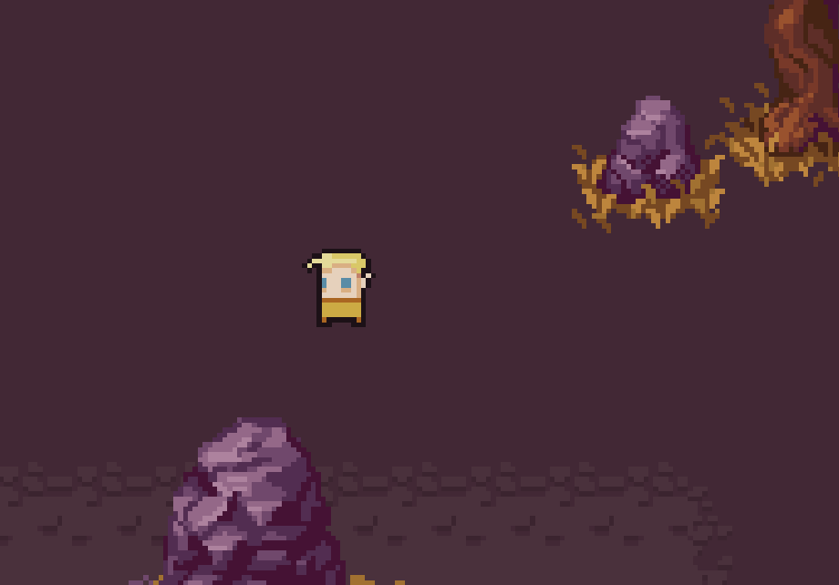

Not only did this break the npc interactions, it also teleported me to some useless place!
One hell of a wizard I am...

Fortunately, the portal code is not complicated. It just loads a "random" scene starting from the index 2 in the scene pool.
```C#
		GameManager.instance.SaveState();
		SceneManager.LoadScene(this.sceneNames[Random.Range(2, this.sceneNames.Length)]);
```
At this point, I remembered poking around the game files and seeing some strings.
This one in particular:
`Ah you found the hidden level. But unfortunately you spawned in the wrong place. `
It belongs to the _level1_ file, which is a scene file in unity.
That means, all we have to do to get there is this:
```C#
using System;
using UnityEngine;
using UnityEngine.SceneManagement;

// Token: 0x0200000F RID: 15
public class Portal : Collidable
{
	// Token: 0x0600002B RID: 43 RVA: 0x00002B01 File Offset: 0x00000D01
	protected override void b(Collider2D a)
	{
		// remove the check for convenience if (a.name == "Wizard")
		{
			GameManager.instance.SaveState();
			SceneManager.LoadScene(this.sceneNames[1]);
		}
	}

	// Token: 0x04000031 RID: 49
	public string[] sceneNames;
}
```

I also changed the _name_ variable back and got rid of my speedhack to make it more playable.

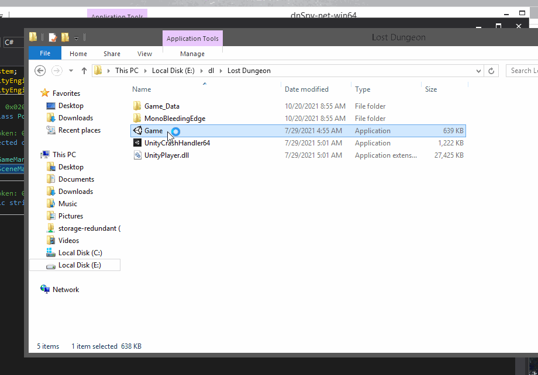

"Spawned in the wrong place", huh...

## The spawning thing

From this point, I spent a couple of hours just tinkering around with the game files.
I thought, that I needed to spawn on the hidden level to get the flag and tried to achieve this in various ways. No matter, how I did it, I was always getting the same "spawned in the wrong place" message. I took a short break and realised one possibility: **there is spawn logic in the GameManager class, so there might be respawn logic**.
Feeling like a total idiot, I went back to the files and found this:

```C#
	public void l()
	{
		this.player.transform.position = GameObject.Find("RespawnPoint").transform.position;
	}
```

**...bruh**

## The fancy respawn button

It was time to finish this challenge. However, just landing at the secret level and respawning sounded way too boring, so I decided to make a special control for this.

I modified the _FixedUpdate_ function of the _Player_ class in this way:
```C#
	private void FixedUpdate()
	{
		if (Input.GetKey("w")) //if w is pressed
		{
			GameManager.instance.l(); //respawn
		}
		float axisRaw = Input.GetAxisRaw("Horizontal");
		float axisRaw2 = Input.GetAxisRaw("Vertical");
		this.o(new Vector3(axisRaw * 1f, axisRaw2 * 1f, 0f));
	}
```

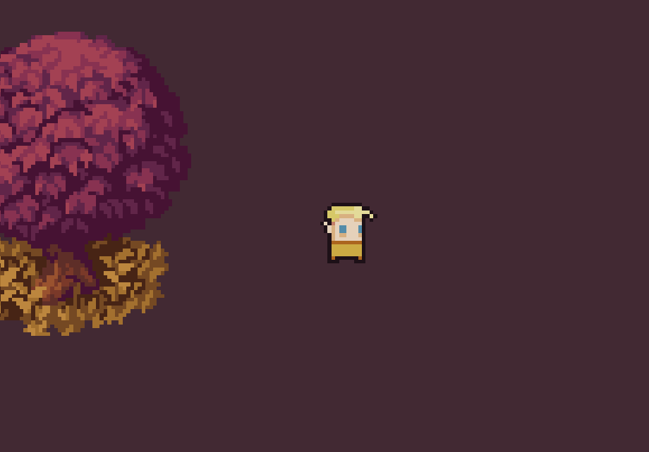

Our final flag: nite{L3vel_100_Maf1a_b055}

## Conclusion

And this is it for the Lost Dungeon! Fantastic entry-level game hacking challenge, in my opinion.
This was (obviously) my first challenge of that kind and I had a lot of fun with it.

**Thanks for reading, stay sharp, and keep pwning <3**
